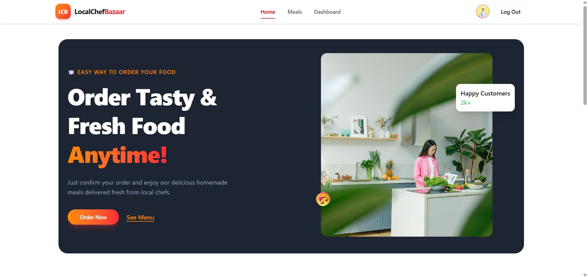
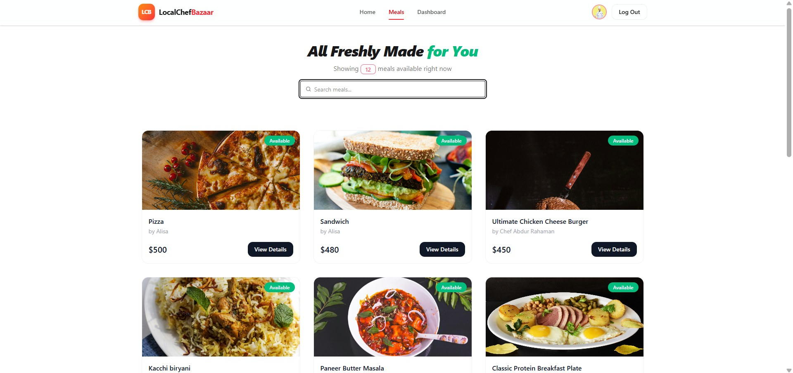
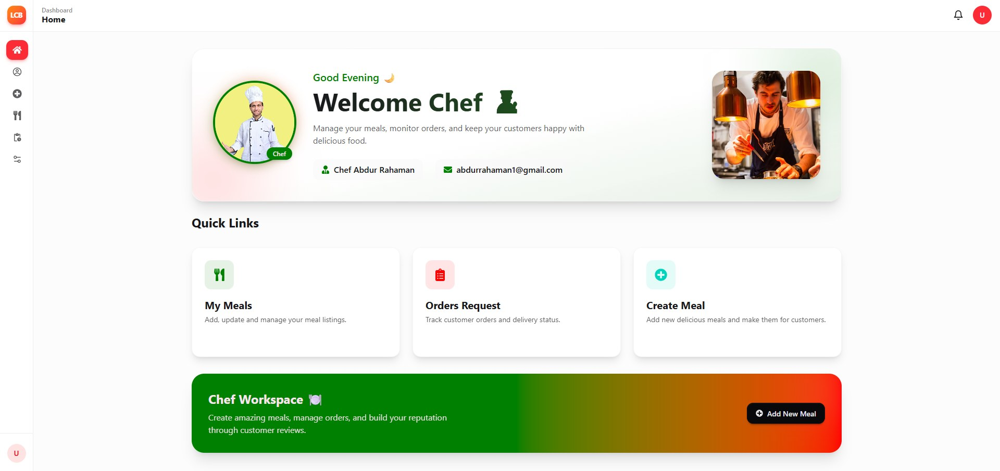
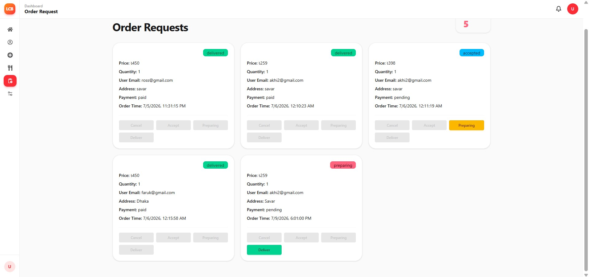
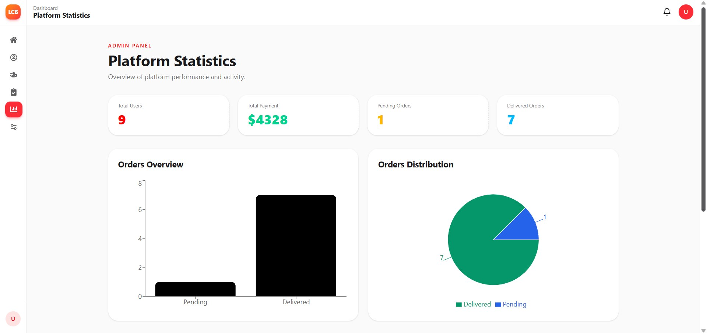
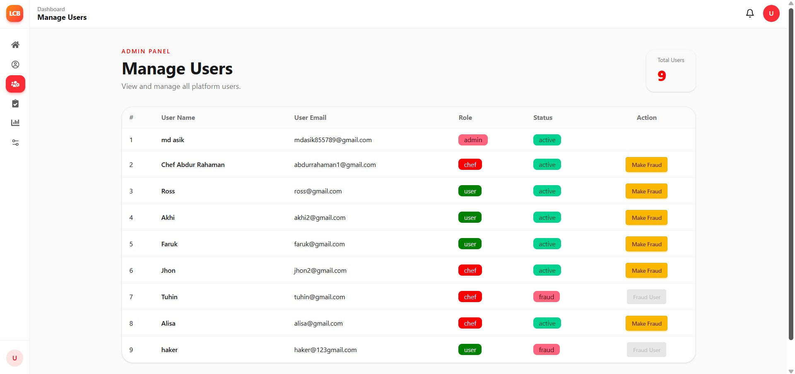

<div align="center">



<br /><br />

# 🍽️ LocalChefBazaar
### Order Tasty & Fresh Food, Anytime!

A full-stack food ordering platform connecting local home chefs with customers — featuring meal browsing, order tracking, a chef workspace, and a role-based admin panel.

<br />

[](https://react.dev)
[](https://vitejs.dev)
[](https://tailwindcss.com)
[](https://nodejs.org)
[](https://www.mongodb.com)

<br />

**[🌐 Live Demo](#)** &nbsp;·&nbsp; **[🐛 Report Bug](#)** &nbsp;·&nbsp; **[✨ Request Feature](#)**

</div>

<br />

---

## 📸 Preview

<table>
<tr>
<td width="50%">
  
  <p align="center"><sub><b>Home</b> — landing page</sub></p>
</td>
<td width="50%">
  
  <p align="center"><sub><b>Meals</b> — browse & search available meals</sub></p>
</td>
</tr>
<tr>
<td width="50%">
  
  <p align="center"><sub><b>Chef Dashboard</b> — chef workspace home</sub></p>
</td>
<td width="50%">
  
  <p align="center"><sub><b>Order Requests</b> — accept, prepare & deliver orders</sub></p>
</td>
</tr>
<tr>
<td width="50%">
  
  <p align="center"><sub><b>Admin Panel</b> — platform statistics</sub></p>
</td>
<td width="50%">
  
  <p align="center"><sub><b>Admin Panel</b> — manage users & roles</sub></p>
</td>
</tr>
</table>

<sub>📁 Screenshots live in <code>screenshots/</code> — swap the files anytime, no README edits needed.</sub>

<br />

---

## ✨ Features

<table>
<tr>
<td width="50%" valign="top">

**🍔 Customer Experience**
- Browse & search all available meals in real time
- Meal cards with chef name, price, and availability status
- View detailed meal info before ordering
- Order confirmation with delivery address & payment tracking

</td>
<td width="50%" valign="top">

**👨‍🍳 Chef Workspace**
- Personalized chef dashboard with quick links
- Create, update & manage meal listings
- Order request queue with status flow: *Accept → Preparing → Deliver*
- Track customer email, address, payment status & order time

</td>
</tr>
</table>

<table>
<tr>
<td width="50%" valign="top">

**🛡️ Admin Panel**
- Platform-wide statistics: total users, payments, pending & delivered orders
- Orders overview bar chart & distribution pie chart
- Manage all users with role badges (*admin, chef, user*)
- Flag/unflag users as fraud with one click

</td>
<td width="50%" valign="top">

**🔐 Roles & Access**
- Role-based dashboards: **Admin**, **Chef**, **User**
- Status indicators (*active / fraud*) per account
- Secure login & session-based navigation

</td>
</tr>
</table>

<br />

---

## 🛠️ Tech Stack

<table>
<tr><td><b>Frontend</b></td><td>React + Vite</td></tr>
<tr><td><b>Styling</b></td><td>Tailwind CSS</td></tr>
<tr><td><b>Backend</b></td><td>Node.js + Express</td></tr>
<tr><td><b>Database</b></td><td>MongoDB</td></tr>
<tr><td><b>Auth</b></td><td>Role-based authentication (Admin / Chef / User)</td></tr>
<tr><td><b>Charts</b></td><td>Chart library for Orders Overview & Distribution graphs</td></tr>
</table>

<sub>⚠️ Update this table to match your actual dependencies from <code>package.json</code>.</sub>

<br />

---

## 📁 Project Structure

```
LocalChefBazaar/
├── client/
│   ├── public/
│   │   └── screenshots/           # README preview images
│   ├── src/
│   │   ├── components/
│   │   ├── pages/
│   │   │   ├── Home.jsx
│   │   │   ├── Meals.jsx
│   │   │   ├── dashboardLayouts/
│   │   │   │   ├── Home.jsx              # Chef dashboard home
│   │   │   │   ├── OrderRequest.jsx
│   │   │   │   ├── ManageUsers.jsx       # Admin
│   │   │   │   └── PlatformStatistics.jsx # Admin
│   │   ├── App.jsx
│   │   └── main.jsx
│   └── package.json
├── server/
│   ├── routes/
│   ├── models/
│   ├── controllers/
│   └── index.js
└── README.md
```

<sub>⚠️ Adjust this tree to match your actual folder layout.</sub>

<br />

---

## 🚦 Getting Started

### Prerequisites

- [Node.js](https://nodejs.org/) `v18+`
- [MongoDB](https://www.mongodb.com/) (local or Atlas connection string)

### Installation

```bash
# 1. Clone the repository
git clone https://github.com/<your-username>/LocalChefBazaar.git
cd LocalChefBazaar

# 2. Install client dependencies
cd client
npm install

# 3. Install server dependencies
cd ../server
npm install

# 4. Run both client & server (in separate terminals)
npm run dev        # client
npm run start       # server
```

Client runs at **`http://localhost:5174`**

<br />

---

## ⚙️ Environment Variables

**Client (`client/.env`)**
```env
VITE_API_BASE_URL=http://localhost:5000
```

**Server (`server/.env`)**
```env
PORT=5000
MONGODB_URI=your_mongodb_connection_string
JWT_SECRET=your_jwt_secret
```

<br />

---

## 🎨 Customization

| What to change | Where |
|---|---|
| Site name, meta tags, favicon | `index.html` |
| Theme colors | `tailwind.config.js` |
| Meal data / API integration | `src/pages/Meals.jsx` |
| Chef dashboard content | `src/pages/dashboardLayouts/Home.jsx` |
| Admin stats & charts | `src/pages/dashboardLayouts/PlatformStatistics.jsx` |
| User role & fraud logic | `server/controllers/userController.js` |

<br />

---

## 🚀 Deployment

<table>
<tr>
<td valign="top" width="33%">

**▲ Vercel** (client)
```bash
npm i -g vercel
vercel
```

</td>
<td valign="top" width="33%">

**◆ Render / Railway** (server)
```bash
# Connect repo,
# set env vars,
# deploy
```

</td>
<td valign="top" width="33%">

**☁️ MongoDB Atlas** (database)
```bash
# Create cluster,
# whitelist IP,
# copy connection URI
```

</td>
</tr>
</table>

<br />

---

## 🗺️ Roadmap

- [ ] Real-time order notifications
- [ ] Payment gateway integration
- [ ] Chef ratings & reviews system
- [ ] Order history for customers
- [ ] SEO optimization (meta tags, Open Graph, sitemap)

<br />

---

## 🤝 Contributing

Contributions, issues, and feature requests are welcome!

```bash
1. Fork the project
2. git checkout -b feature/AmazingFeature
3. git commit -m 'Add some AmazingFeature'
4. git push origin feature/AmazingFeature
5. Open a Pull Request
```

<br />

---

## 📄 License

Licensed under the **MIT License** — see [LICENSE](./LICENSE) for details.

<br />

---

<div align="center">

## 📬 Contact

Built by **Md Asik**

<a href="#"></a>
<a href="#"></a>
<a href="mailto:your.email@example.com"></a>

<br /><br />

⭐️ If you like this project, consider giving it a star!

</div>